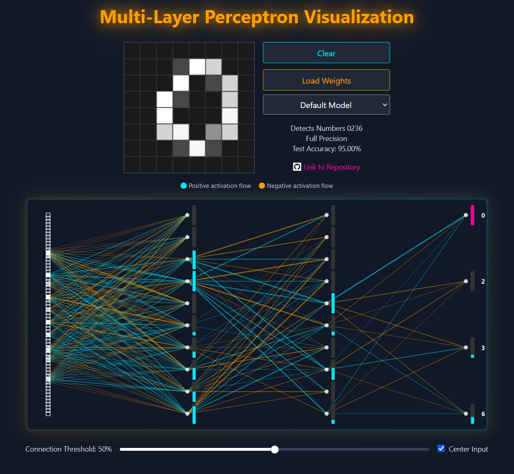

# Neural Network Visualizer

Online version **[here](https://cpldcpu.github.io/neural-network-visualizer/)**.

This is a simple neural network visualizer. It began as a Claude Artifact and was completed with the "Copilot Edits" interface, released only yesterday. Very few lines were written by hand, showcasing the advances in GenAI up to today (2024-Nov-30). Compare this to the early days of LLMs when they struggled to [synthesize a simple CPU in HDL](https://github.com/cpldcpu/LLM_HDL_Design).

## Features

Why is it special? This app provides an intuitive way to visualize the power of simple multi-layer perceptrons. You can draw an 8x8 pixel image, and the connections and neuron activations update in real time.

The network model is a simple multi-layer perceptron with 64 input neurons (8x8), two hidden layers with 10 neurons each, and between 4 and 10 output neurons. Four models are provided, trained on different subsets of the MNIST dataset. `model3` is a binary network (BitNet) trained using Quantization Aware Training (QAT).

[](https://cpldcpu.github.io/neural-network-visualizer/)

## How to Use

Draw a digit on the 8x8 pixel canvas and watch the neuron activations propagate through the network in real time. The thickness of the lines between neurons indicates the product of weight and activation. Blue lines indicate positive weights, and red lines indicate negative weights. A fuel gauge next to each neuron indicates the activation level.

- `Clear`: Clears the canvas.
- `Model selector`: Pick one of four models.
- `Load weights`: Load custom models in JSON format.
- The `Connection threshold` slider: Adjust the threshold for displaying connections, limiting the display to the most salient connections.
- `Center input`: Toggles automatic centering of the input image. Centering improves network accuracy as the MNIST dataset consists of centered images, and the inductive properties of the MLP architecture are limited otherwise.

## Neural Network and Training

The training code (Python) can be found in the `train` directory. The training run is configured directly in the `trainmnist.py` script. After completing the training run, the weights are saved to a JSON file. The JSON file can be loaded into the visualizer using the `Load weights` button.

```python

classes     = [0,1,2,3,4,5,6,7,8,9]   # selection of classes to use for the output neurons
QuantType   = 'None'                  # Quantization type: 'None' or 'Binary'
filename    = 'weights_full_10c_noaug.json'   # file to save the weights to
Name        = 'Detects All Number\nFull Precision, No Augmentation\n'   # description of the model
``` 

The model structure is shown below. A layer normalization is applied to the input of every layer, which greatly improves the training stability. The `elementwise_affine` parameter is set to `False` to reduce the number of parameters. Likewise, no bias is used in the linear layers.  'BitLinear' is a custom linear layer for quantization-aware training, for QuantType='None' it is a standard linear layer.

```
Sequential(
  (0): LayerNorm((64,), eps=1e-05, elementwise_affine=False)
  (1): BitLinear(in_features=64, out_features=10, bias=False)
  (2): ReLU()
  (3): LayerNorm((10,), eps=1e-05, elementwise_affine=False)
  (4): BitLinear(in_features=10, out_features=10, bias=False)
  (5): ReLU()
  (6): LayerNorm((10,), eps=1e-05, elementwise_affine=False)
  (7): BitLinear(in_features=10, out_features=10, bias=False)
)
```

## Building

The core code can be found in [`webcode/src/pages/index.tsx`](webcode/src/pages/index.tsx) and was initially generated as a *Claude-3.5-Sonnet (New)* artifact based on React. It turned out that exporting artifacts from claude is a major pain, especially once the artifact reaches that magical length where claude starts to get limited by context length and the output quality degrades.

Luckily, I found the [Claude Artifacts Starter](https://github.com/EndlessReform/claude-artifacts-starter) which was a great help in providing an environment that allowed to deploy the artifact to a github.io page.

All web code is in the `webcode` directory. Read Claude Artifacts Starter's [README](webcode/README.md) for more information.
